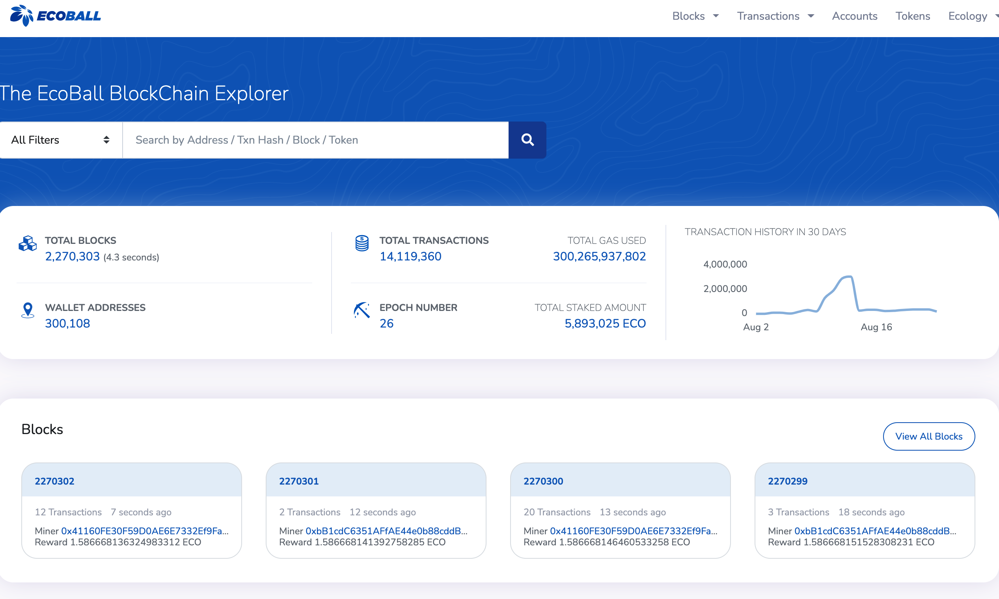
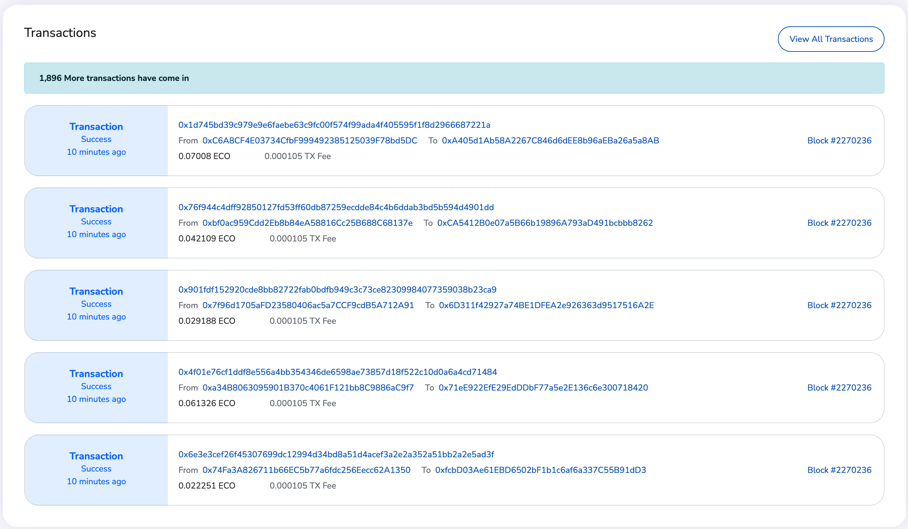

# Blockchain explorer

Blockchain explorer allows users to explorer the block and transaction information. ECO holders, may also use this page to apply to become a candidate, participate in the validation campaign, or participate in the staking. For more information, please see [Validator Matters](../staking-and-voting/).

Link to Ecoball blockchain explorer: [https://scan.ecoball.org/blocks](https://scan.ecoball.org/blocks)

