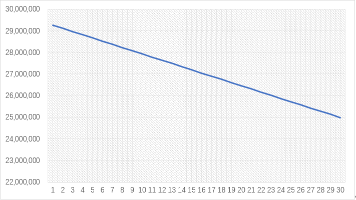

# Token - ECO

**This page introduces  ECO and the tokenomics behind.**

## What is ECO? 

ECO is the native token of the Ecoball ecosystem which serves as the transaction settlement medium in the Ecoball blockchain system and assumes the functionalities of bookkeeping, governance and equity certificates.

Any transaction on the Ecoball blockchain needs to consume ECO, similar to gas fees on other network. But the cost of consumption is negligible for normal transactions; however, in case of malicious attacks, a large amount of fuel will be consumed, making the attacker unable to sustain. Therefore ECO also safeguards the Ecoball blockchain.

## ECO Token Economics

### 1.1.   Total Quantity

Initial Minting Quantity: 378 million

Total Minting Quantity: 2.1 billion

Distribution:

.PNG>)

Purpose of the distribution：

### 1.2.  Mining Rules

In the early stage of the community, pioneer miners deserve higher rewards. To reward these pioneers, we adopt an ECO releasing schedule with a linear decreasing model, early miners will receive more ECO per block as rewards. Going forward as the platform become stable and robust, ECO releasing amount will gradually decrease on per a block basis.

The formula to calculate block rewards (ECO release) during each voting cycle:

Below are illustrations of the mining reward rules:

### 1.3.  Staking Rewards

A key indicator to the robustness of a Proof-of-Stake system is the staking ratio of the network. A high staking ratio will make the system hard-to-attack. However, once the staking ratio pass a point where it becomes too high, the system will be overwhelmed, consequently, liquidity in the system will be decreased. Therefore, in the long run, the staking ratio will dynamically adjust itself to reach equilibrium. Referring to current PoS public blockchains, the equilibrium point should be where the staking ratio is between 0.5 and 0.6.

The self-balancing mechanism of the staking ratio is realized by the negative correlation between the staking yield and the staking ratio. When the staking ratio drops, the staking yield will increase to encourage more users to stake; when the staking ratio increases, the staking yield will drop for users to seek other opportunities. The security and stability of the system is maintained through such mechanism.

The following chart illustrates an estimation of staking yields vs staking ratios:

