# Deploy Node

Validator node software is a cross-platform command line program, which for now only supports Linux system.&#x20;

Integration for MacOS, Windows will be coming soon.

### Download node software 

Create a folder and name it 'Ecoball' in the Linux system as the working directory of the Ecoball blockchain system, download the node software package to the folder:

> mkdir ecoball
>
> cd ecoball
>
> git clone [https://github.com/EcoballChain/validator-node](https://github.com/EcoballChain/validator-node)
>
> ​

The downloaded file:

> ls -l

Decompress the file, then in the decompressed directory, the default directory file name is 'validator\_node'. If you need to deploy multiple nodes, you may change rename the nodes to 'validator\_node1', 'validator\_node2', 'validator\_node3' and so on.

> cd validator\_node
>
> ls
>
> README.md config.toml ecoball spec.json

* README.md is the node installation configuration description file
* config.toml is the node startup configuration file
* ecoball is the node software,executable binary files
* spec.json is the initial data and structure specification file

The downloaded software usually does not have executable permissions, so it is necessary to authorize the node software.

> chmod +x ecoball

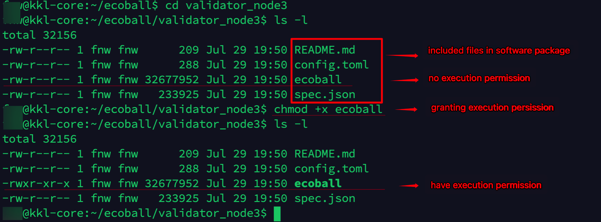

In addition, the corresponding configuration needs to be performed according to the instructions of the README.md file. Follow below steps for configuration:

Step 1: Create a wallet;

Step 2: Create a password file;

Step 3: Modify the startup configuration file;

Step 4: Launch the node software;

Step 5: Staking.

### Step 1: Create a wallet 

Create a wallet:

> ./ecoball -c config.toml account new

A password prompt appears. Enter the wallet password twice to generate a wallet address. For example, here is the wallet address:

> 0x01c9a1515ae1d0df16e30f48ab5cbddcfd9413d4

Write down your wallet address and password, keep them safe.

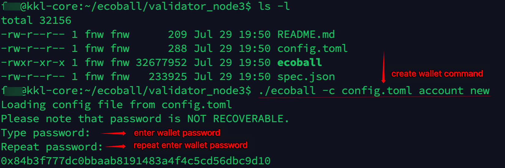

After the wallet is created, the system automatically creates a data directory in the current directory, which contains the keys/espuma/directory structure. The following is the keystore file of the wallet. For asset security, it is recommended that this file be backed up and stored properly.

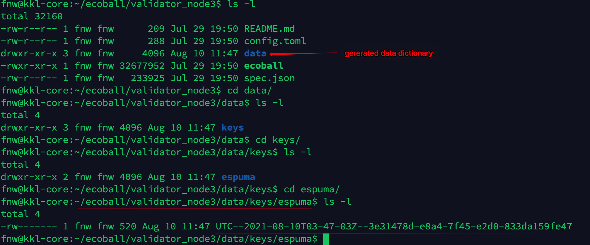

### Create a password file 

create a password file.

> vim passwd.txt

Then enter the password you created early along with wallet creation above. Save and exit.

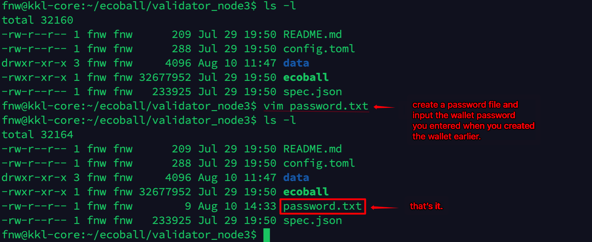

### Modify the startup configuration file 

> vim config.toml

The initial value of the node configuration file:

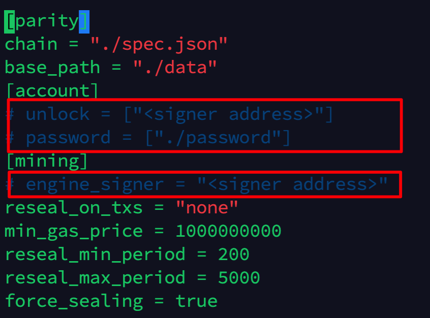

Modify following parameters according to the instructions in the README.md file:

* engine signer address: engine signature wallet address, use the wallet address created before as the transaction signature wallet
* password file: fill in the password file created before, and note that the brackets inside cannot be lost, otherwise an error will be reported
* unlock: unlock the wallet address, same as the engine signer, fill in the wallet address created before, the brackets cannot be lost

Save and exit. The modified configuration file is as follows:

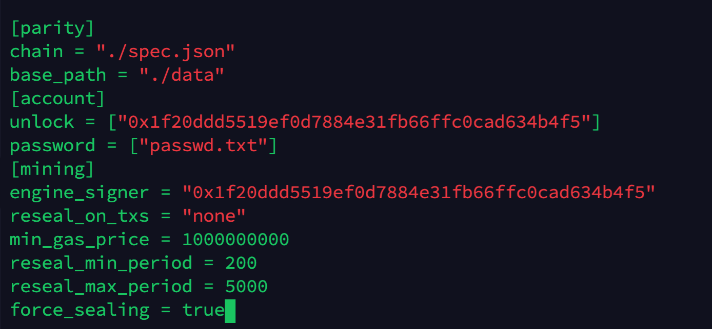

## Launch node software to console 

Execute the following command to enter the console. If there is any error in the configuration file, the program cannot be started normally, and error message will appear; if there is no error in the configuration file, it will start normally, and you can observe the scrolling of the interface characters:

> ./ecoball --config config.toml

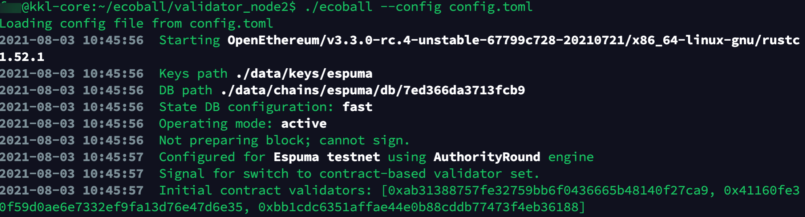

## Launch validator node software to background 

Launch the node software to run in the background, and output the log to the log file. It will not be closed because the console is closed or disconnected. The following operations are required:

> nohup ./ecoball --config config.toml >ecoball.log 2>&1 &

If you need to monitor real-time logs, you can run the following command:

> tail -f ecoball.log

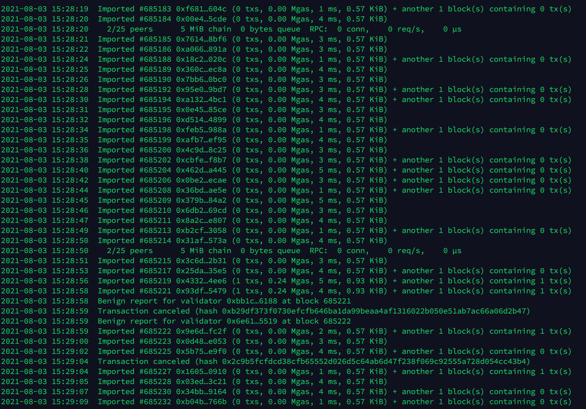

## Running in Windows 10 environment 

At present, there is only Linux version of the node program. If the user does not have a Linux computer and needs to test under Windows, he must install the Linux running environment on Windows. Windows10 is recommended here, because the Linux subsystem is native supported. You can play Linux directly on Windows 10, without the need for a separate installation of software like a virtual machine.

Users can first find the Microsoft Store on Windows 10, and then search “Linux” in the App Store. There are many versions that will appear. The recommended version is Ubuntu 20.04 LTS. If you have a Linux system installed, everything will work the same.

Search for Linux to find and install Ubuntu:

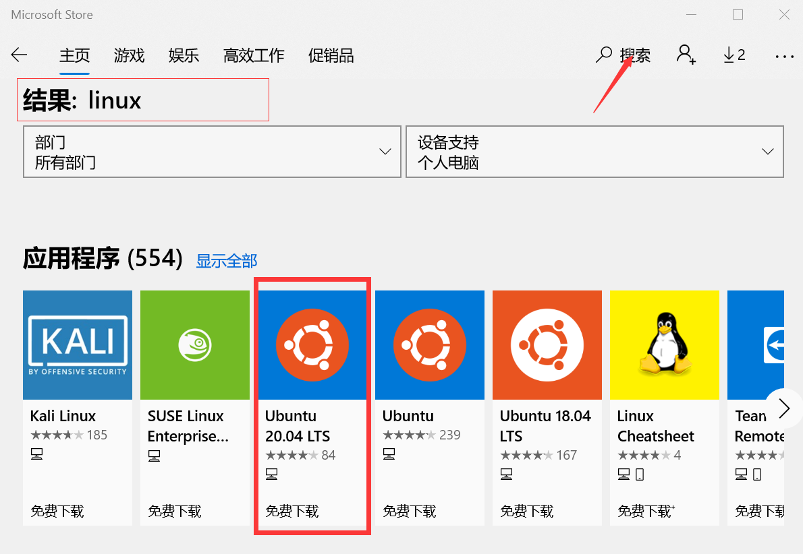

If Ubuntu is installed, you can start it from this screen:

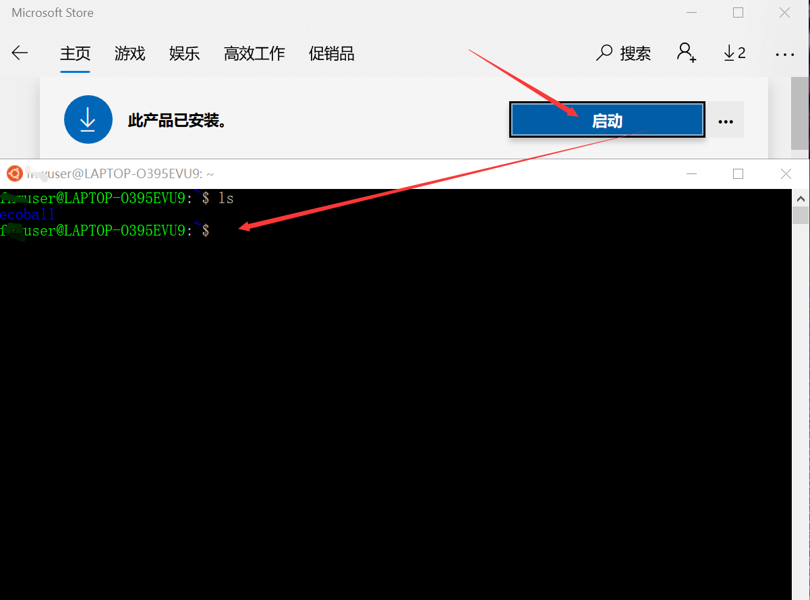

The next time you want to use ubuntu, you don't need to open the Microsoft Store. You can start Ubuntu directly from the menu bar:

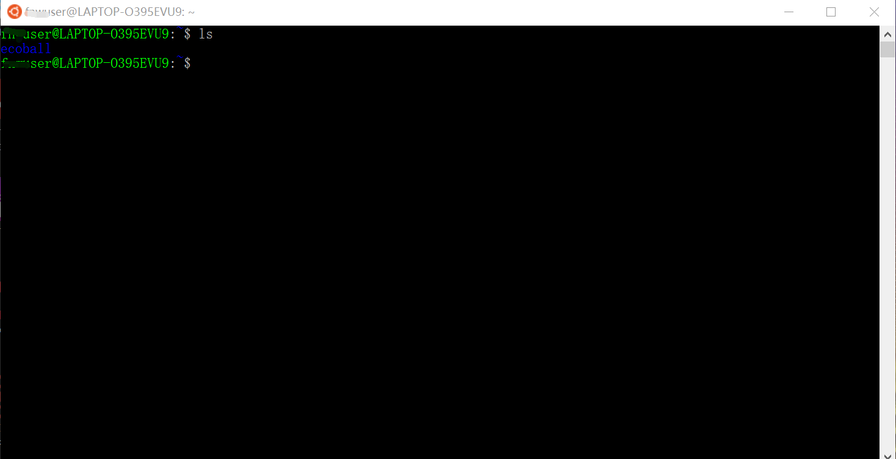

## Become a validation node 

Once the node software is installed, deployed and up and running, it is a normal node, synchronizing node data and validate transactions normally. However, normal nodes cannot generate blocks. In order to generate blocks, they must become validation nodes. At the current stage, to become a validation node, you must state 500,000 ECO. For details on the operation process, see [the staking topic](https://stakingspec.md).

## Node Hardware Configuration 

### The standard configuration 

Only the core configuration of the node server is listed below:

* CPU: 4 cores
* Memory: 16G
* Hard disk: 1T
* Bandwidth: 10M

**Normal nodes can adopt this standard configuration and perform tasks such as synchronizing data and validating transactions**

### The recommended configuration 

Only the core configuration of the node server is listed below:

* CPU: 8 cores
* Memory: 32G
* Hard disk: 2T
* Bandwidth: 20M to 100M

**The verification node recommends this recommended configuration to perform tasks such as synchronizing data, validating transactions, generating blocks, and so on.**

## Basic commands 

Curl is a tool you need to test basic commands, and most Linux systems come with .

If the test is performed on a local node machine, the address and port of the node's external service is :[http://127.0.0.1:8545](http://127.0.0.1:8545).

If the deployment to the public internet, and the domain name resolution, you can access through the domain name, such as [http://api.ecoball.org:8545](http://api.ecoball.org:8545).

The first line of each of the following commands is the request execution and the second line is the return response.

#### web3\_clientVersion 

Returns the client version number.

curl -H "Content-Type: application/json" -X POST [http://127.0.0.1:8545](http://127.0.0.1:8545) --data '{"jsonrpc":"2.0","method":"web3\_clientVersion","params":\[],"id":67}'

{"jsonrpc":"2.0","result":"EcoBall//v0.9.9-unstable/x86\_64-linux-gnu/rustc1.52.1","id":67}

#### web3\_sha3 

Returns the keccak-256 of the given value.

curl -H "Content-Type: application/json" -X POST [http://127.0.0.1:8545](http://127.0.0.1:8545) --data '{"jsonrpc":"2.0","method":"web3\_sha3","params":\["0x68656c6c6f20776f726c64"],"id":64}'

{"jsonrpc":"2.0","result":"0x47173285a8d7341e5e972fc677286384f802f8ef42a5ec5f03bbfa254cb01fad","id":64}

#### net\_version 

Returns the current network ID.

curl -H "Content-Type: application/json" -X POST [http://127.0.0.1:8545](http://127.0.0.1:8545) --data '{"jsonrpc":"2.0","method":"net\_version","params":\[],"id":67}'

{"jsonrpc":"2.0","result":"100","id":67}

#### net\_listening 

Returns the client listening network connection status.

curl -H "Content-Type: application/json" -X POST [http://127.0.0.1:8545](http://127.0.0.1:8545) --data '{"jsonrpc":"2.0","method":"net\_listening","params":\[],"id":67}'

{"jsonrpc":"2.0","result":true,"id":67}

#### net\_peerCount 

Returns the number of nodes currently connected to the client.

curl -H "Content-Type: application/json" -X POST [http://127.0.0.1:8545](http://127.0.0.1:8545) --data '{"jsonrpc":"2.0","method":"net\_peerCount","params":\[],"id":74}'

{"jsonrpc":"2.0","result":"0x1","id":74}

#### eth\_protocolVersion 

Returns the current Ethereum protocol version number. Since EcoBall is Ethereum compatible, the protocol version number lets you know if the dApp is suitable for migration.

curl -H "Content-Type: application/json" -X POST [http://127.0.0.1:8545](http://127.0.0.1:8545) --data '{"jsonrpc":"2.0","method":"eth\_protocolVersion","params":\[],"id":67}'

{"jsonrpc":"2.0","result":"65","id":67}

#### eth\_gasPrice 

Returns the current gas price.

curl -H "Content-Type: application/json" -X POST [http://127.0.0.1:8545](http://127.0.0.1:8545) --data '{"jsonrpc":"2.0","method":"eth\_gasPrice","params":\[],"id":71}'

{"jsonrpc":"2.0","result":"0x0","id":71}

#### eth\_accounts 

Returns the wallet address of the current node.

curl -H "Content-Type: application/json" -X POST [http://127.0.0.1:8545](http://127.0.0.1:8545) --data '{"jsonrpc":"2.0","method":"eth\_accounts","params":\[],"id":71}'

{"jsonrpc":"2.0","result":\["0x01c9a1515ae1d0df16e30f48ab5cbddcfd9413d4"],"id":71}

#### eth\_blockNumber 

Returns the current block number.

curl -H "Content-Type: application/json" -X POST [http://127.0.0.1:8545](http://127.0.0.1:8545) --data '{"jsonrpc":"2.0","method":"eth\_blockNumber","params":\[],"id":71}'

{"jsonrpc":"2.0","result":"0xfaf","id":71}

#### eth\_getBalance 

Returns the balance of the given wallet address.

curl -H "Content-Type: application/json" -X POST [http://127.0.0.1:8545](http://127.0.0.1:8545) --data '{"jsonrpc":"2.0","method":"eth\_getBalance","params":\["0x01c9a1515ae1d0df16e30f48ab5cbddcfd9413d4", "latest"],"id":1}'

{"jsonrpc":"2.0","result":"0xbcec172badbc540000","id":1}

In the JSON object, result is the balance corresponding to the wallet address, the hexadecimal number, which can be converted to base 10, and then divided by 10\*\*18, to get the number of ECO.
