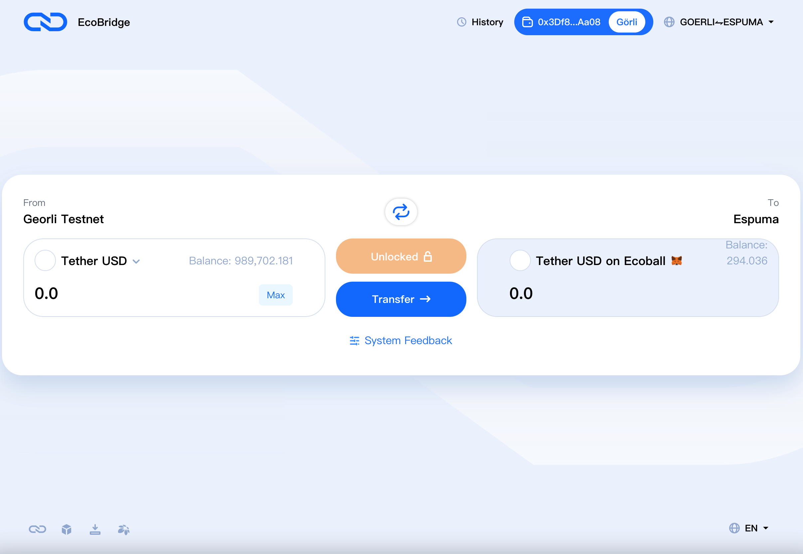

# Assert cross chain

The EcoBridge cross-chain Bridge provides the ability to interact with assets and data between external blockchains and Ecoball blockchains, allowing users to transfer assets between EVM compatible chains. Cross-chain Bridges provide fast and secure connections between EVM-compliant blockchains, providing scalability and interoperability.

EcoBridge currently supports cross-chain from Ethereum to Ecoball. Here's how the Ethereum Testnet Georli crosses chain to the Ecoball testnet chain.

To use the bridge function, you must first install a web-based digital wallet. For details, see [Web digital wallet](../digital-wallet/web-digital-wallet.md).

1）Open the chain bridge page：[https://bridge.ecoball.org/](https://bridge.ecoball.org/)。By default, the page for connecting to the wallet is displayed, as shown in the following figure：

2）Click the “connect” button，the select wallet page is displayed. As shown in the figure below：

3）Here we need to select MetaMask wallet, click MetaMask to enter the cross-chain bridge page, as shown in the picture below：

4）Select the tokens to cross the chain and add them if they are not on the list：

5）MetaMask authorization is required for unlocking on the original chain. Click confirm button for authorization, as shown in the figure below：

6）After unlocking, click the "Transfer" button to Transfer the Token, as shown below：

7）If you need to confirm asset transfer, a confirmation dialog box is displayed, as shown in the following figure：

8）After confirming the Token transfer, MetaMask wallet will be called again for authorization, as shown in the figure below：

9）After authorization, the system immediately transfers the cross-chain assets, which needs to wait for the confirmation of several blocks. Depending on the network condition, it generally takes several minutes, as shown in the figure below：

After sufficient block confirmations, the tokens on the original chain are converted into tokens on the target chain.

