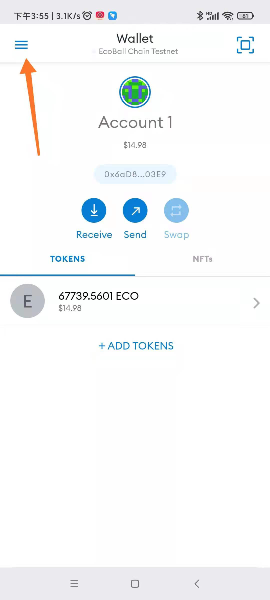
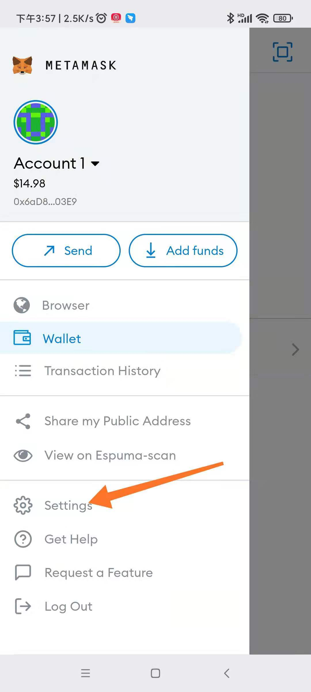
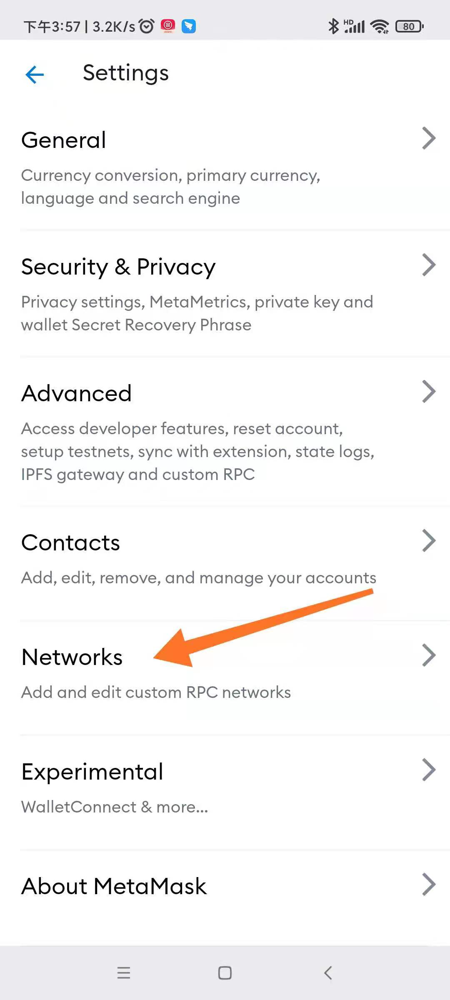
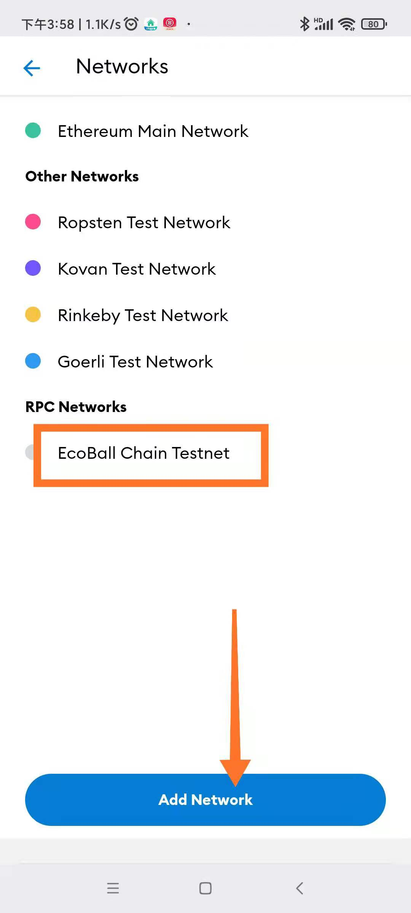
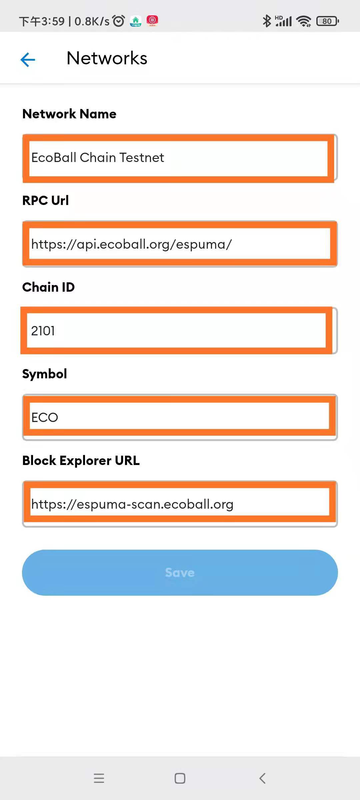
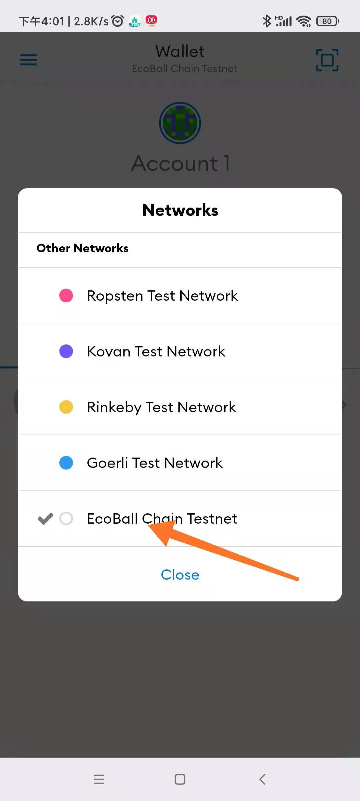

# Mobile digital wallet

MetaMask or IMToken is recommended for mobile digital wallets. Like the web-based digital wallet, you need to set up the EcoBall network before using it. Network parameters refer to [Web Digital Wallet](web-digital-wallet.md).

The method of configuring network parameters for digital wallet on mobile terminal is basically the same as that on web terminal, as shown below:

1\)click the function button in the upper left corner of the wallet main interface to pop up the main menu：

2\)click the "Settings" button under the main menu to pop up the Settings menu：

3\)click the "network" menu inside the Settings menu to pop up the network Settings menu：

4\)click the "Add Network" button at the bottom of the displayed network Settings menu：

5\)enter the configuration parameters on the page that is displayed. For details, see the table in [Web Digital Wallet](https://github.com/EcoballChain/docs.ecoball.org/tree/295b3fcb6f7f46fe8fdfaa0e690f3c10f5e9e5a5/digital-wallet/walletweb.md)：

After the input is complete, click "Save" button. If there is no problem with parameters, the save will be successful; otherwise, an error message will be displayed, and you can continue to save after correcting the error message.

At this point, network parameters are set.

6\)To perform EcoBall blockchain operations, select the Ecoball Testnet network：

