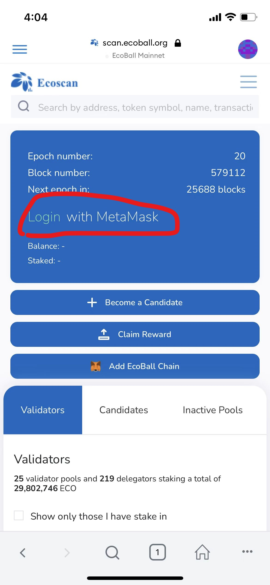
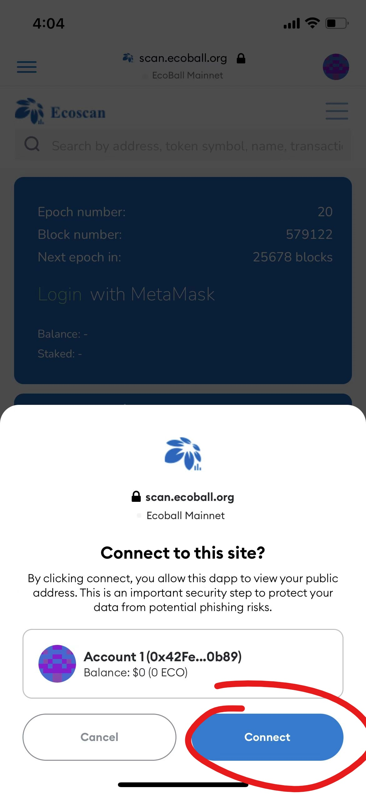

# Mobile version

Ecoball chain currently support MetaMask and ImToken on mobile, please find below links to download on your phone:

MetaMask: [https://metamask.io/download](https://metamask.io/download)

ImToken: [https://token.im/download](https://token.im/download)

## Mobile Wallet Connect to Ecoball Mainnet

You may set up your mobile wallet both manually and automatically:

**1.      MetaMask – manual set up**

On your mobile app, go to _**My Account → Settings → Networks → Add Network**_, then enter below information accordingly:

| Network Name                 | EcoBall Mainnet                                                      |
| ---------------------------- | -------------------------------------------------------------------- |
| NewRPC URL                   | [https://api.ecoball.org/ecoball/](https://api.ecoball.org/ecoball/) |
| Chain ID                     | 2100                                                                 |
| Currency Symbol (optional)   | ECO                                                                  |
| Block Explore URL (optional) | [https://scan.ecoball.org/](https://scan.ecoball.org)                |

.jpg>) .jpg>) .jpg>) 

**2.      MetaMask – automatic set up**

You can also set up connect using Ecoball automatic connection, follow the steps:_ **My Account → Browser → Search → Go to **_[https://scan.ecoball.org/validators](https://scan.ecoball.org/validators) _**→ ‘Add EcoBall Chain’**_

.jpg>) .jpg>) .jpg>) 

 

**3.      ImToken – manual set up**

On your mobile ImToken app, go to _**My Profile → Settings → Node Settings → Ethereum → ‘+’ → Customize**_, then enter below information:

| Network Name                 | EcoBall Mainnet                                                      |
| ---------------------------- | -------------------------------------------------------------------- |
| RPC URL                      | [https://api.ecoball.org/ecoball/](https://api.ecoball.org/ecoball/) |
| Chain ID                     | 2100                                                                 |
| Symbol (optional)            | ECO                                                                  |
| Block Explore URL (optional) | [https://scan.ecoball.org/](https://scan.ecoball.org)                |

   .jpg>)   

&#x20;

**4.      ImToken – automatic set up**

You may also set up Ecoball connection using automatic set up, go to _**Browser → Enter link: **_https://scan.ecoball.org/validators_** → Add EcoBall Chain:**_

 .jpg>)  .jpg>)

&#x20;

&#x20;

