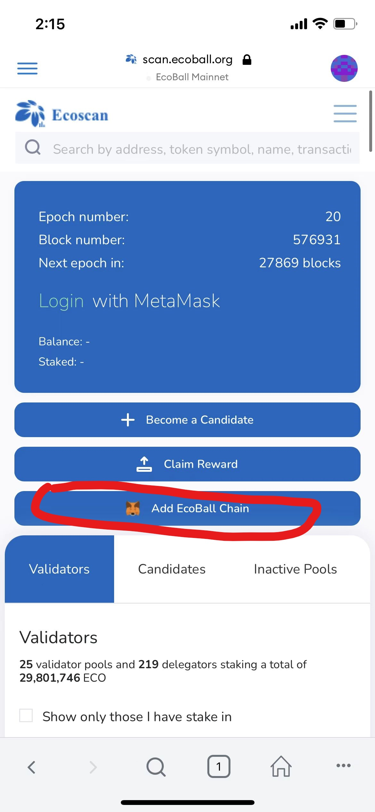
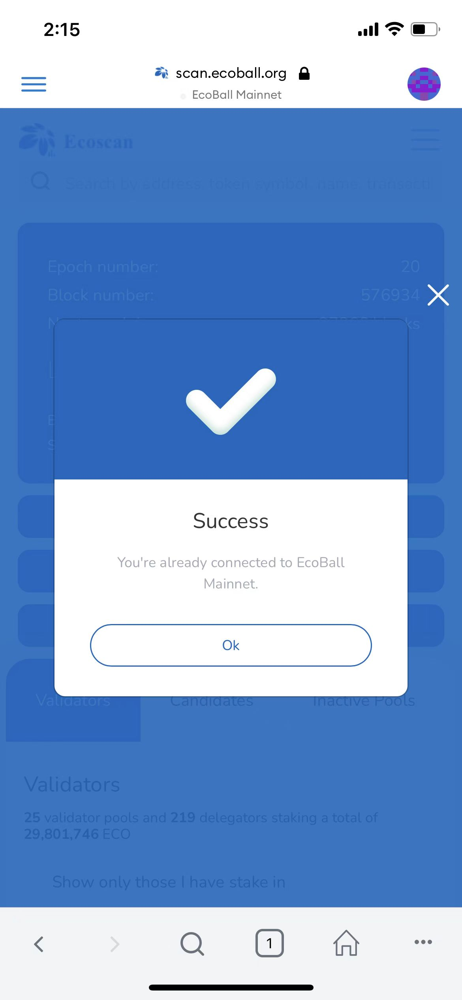

# Mobile Wallet

Ecoball chain supports MetaMask and ImToken on mobile, please go to their official pages or visit mobile app store to download.

## Connect to Ecoball Mainnet

We recommend you to set up your wallet using automatic set up. However, you may also set up your mobile wallet in a manual way.

#### **1. MetaMask – Automatic Set Up**

You can also set up connect using Ecoball automatic connection, follow the steps:_ **My Account → Browser → Search → Input **_[https://scan.ecoball.org/validators](https://scan.ecoball.org/validators) _**→ ‘Add EcoBall Chain’**_

 (1).jpg>) .jpg>) .jpg>) 

 

#### **2. ImToken – Automatic Set Up**

You may also set up Ecoball connection using automatic set up, go to _**Browser → Input **_https://scan.ecoball.org/validators_** → Add EcoBall Chain:**_

 .jpg>)  .jpg>)

#### **3. MetaMask – Manual Set Up**

On your mobile app, go to _**My Account → Settings → Networks → Add Network**_, then enter below information accordingly:

| Network Name                 | EcoBall Mainnet                                                      |
| ---------------------------- | -------------------------------------------------------------------- |
| NewRPC URL                   | [https://api.ecoball.org/ecoball/](https://api.ecoball.org/ecoball/) |
| Chain ID                     | 2100                                                                 |
| Currency Symbol (optional)   | ECO                                                                  |
| Block Explore URL (optional) | [https://scan.ecoball.org/](https://scan.ecoball.org)                |

.jpg>)  (1).jpg>)  (1).jpg>) 

****

**4. ImToken – Manual Set Up**

On your mobile ImToken app, go to _**My Profile → Settings → Node Settings → Ethereum → ‘+’ → Customize**_, then enter below information:

| Network Name                 | EcoBall Mainnet                                                      |
| ---------------------------- | -------------------------------------------------------------------- |
| RPC URL                      | [https://api.ecoball.org/ecoball/](https://api.ecoball.org/ecoball/) |
| Chain ID                     | 2100                                                                 |
| Symbol (optional)            | ECO                                                                  |
| Block Explore URL (optional) | [https://scan.ecoball.org/](https://scan.ecoball.org)                |

.jpg>) .jpg>) .jpg>) .jpg>)   

&#x20;

&#x20;

&#x20;

