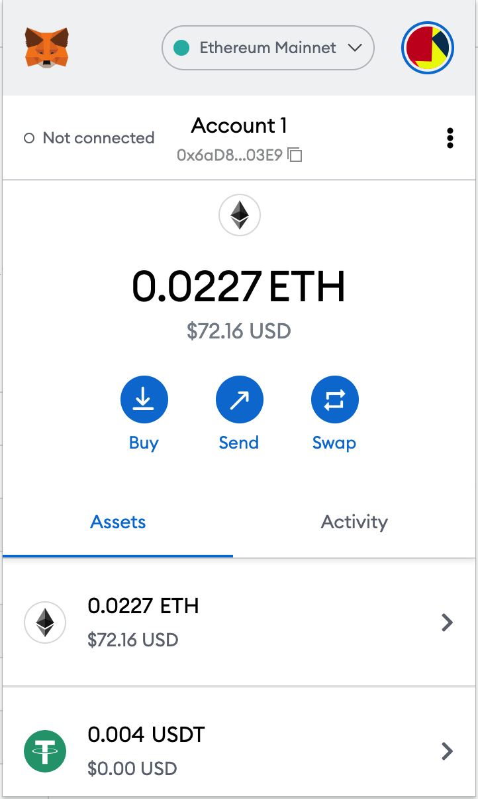
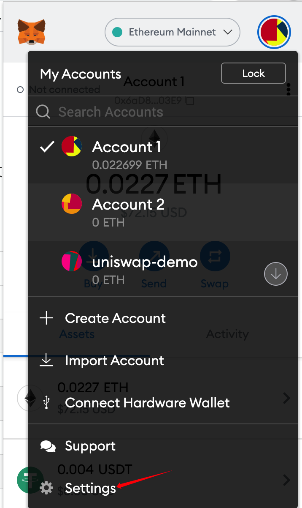
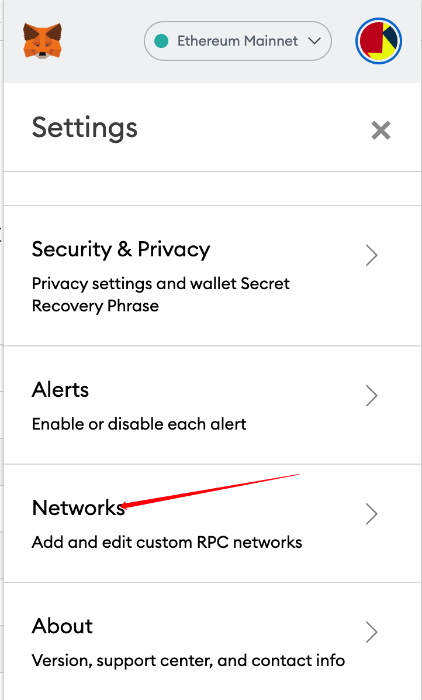
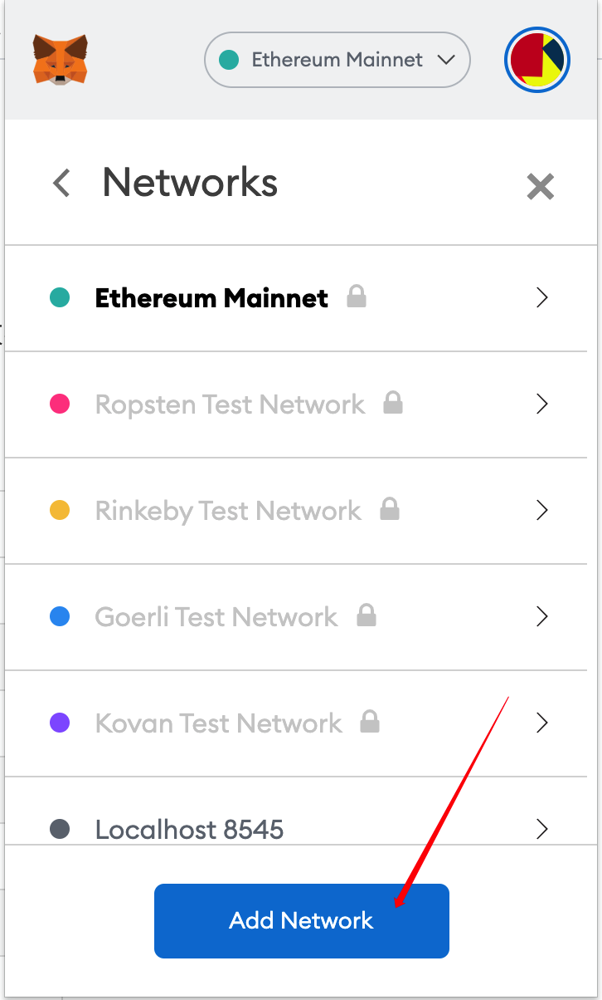
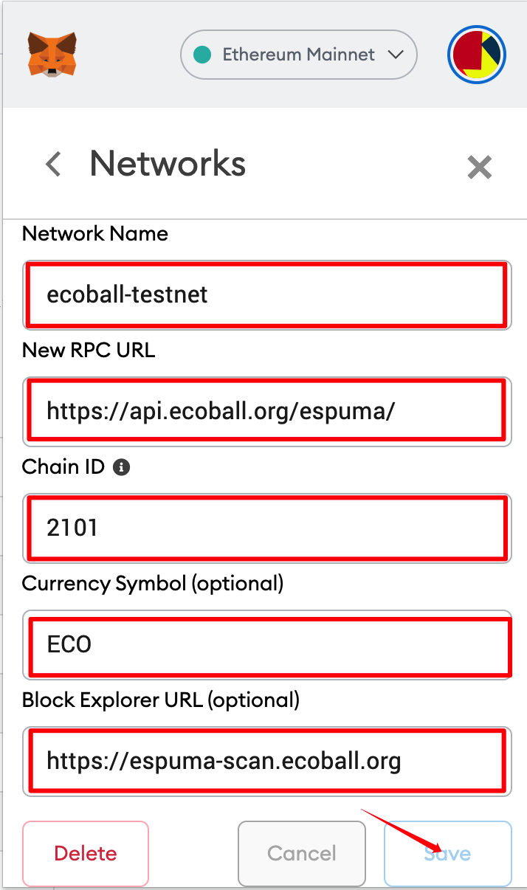
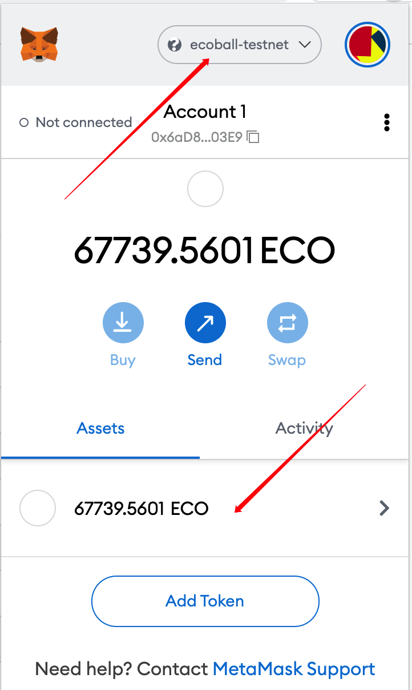

# Web digital wallet

The web digital wallet adopts the well-known MetaMask \(Little Fox\) as a browser plug-in, which supports mainstream chrome, Firefox, Edge and other mainstream browsers. Users can download and install it by themselves.

Start by searching for the "MetaMask" extension in your browser, and when you find it, add it to your browser. The MetaMask wallet can be launched by clicking on the MetaMask icon in the toolbar.

After starting the MetaMask wallet, users need to manually add Ecoball network node information to the MetaMask Settings first.

The configurations of the Ecoball Chain test network are as follows:

After configuring the above network information, you can create or import the wallet of Ecoball blockchain, and then query and transfer the assets.

Here is the MetaMask wallet network configuration process:

1\)click the function button in the upper right corner of the wallet's main interface:

2\)click the "Settings" button at the bottom of the drop-down menu:

3\)click the "Network" menu inside the menu to expand:

4\)click "Add Network" in the lower part of the page:

5\)enter the configuration parameters, as shown in the table above:

After input, click the "Save" button. If there is no problem in filling in the parameters, the save will be successful; otherwise, an error will be displayed.

6\)select the Ecoball-Testnet network and perform related operations:

