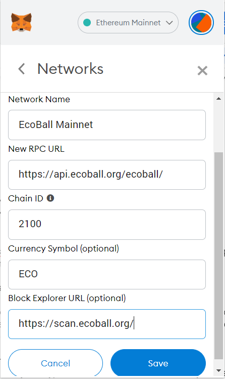
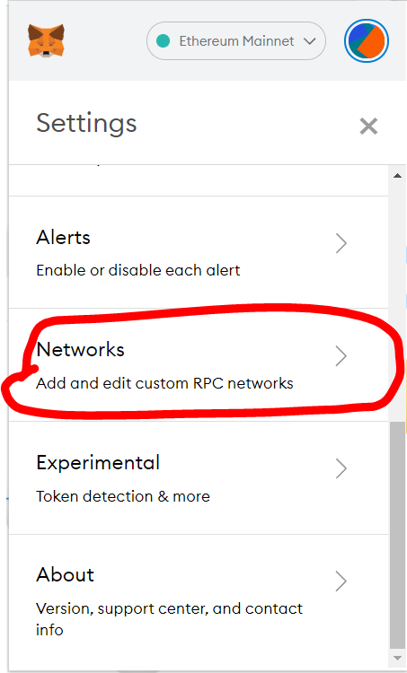
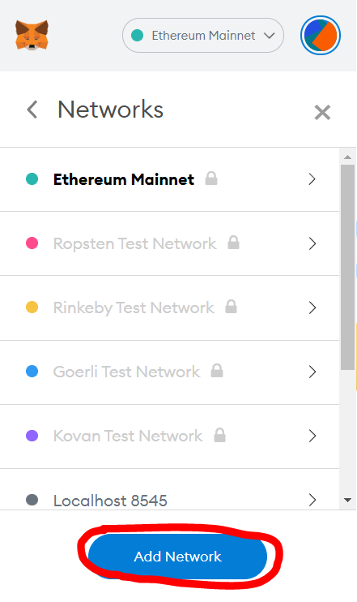
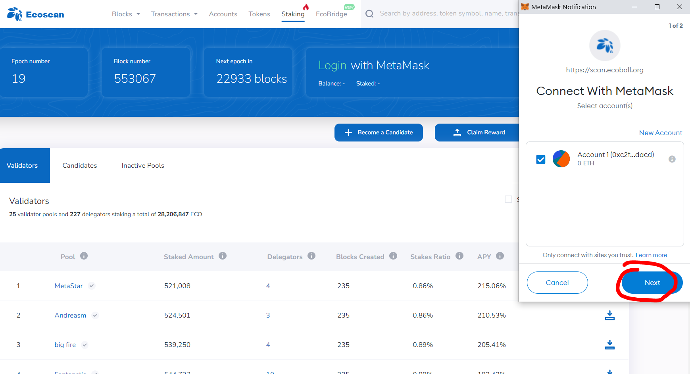
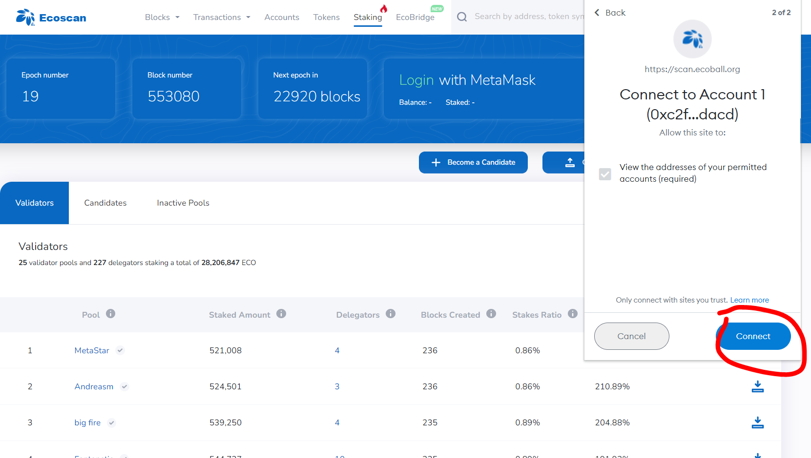
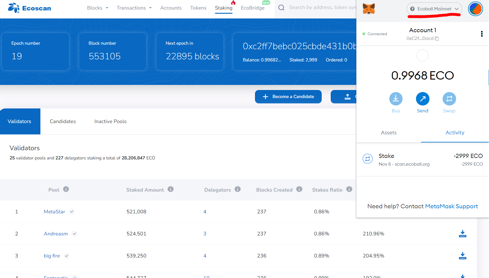

# Web digital wallet

Ensure you have installed MetaMask wallet on your browser. If you have not yet done so, visit [https://metamask.io/](https://metamask.io) for details.

If you have installed MetaMask wallet, add Ecoball mainnet to your wallet through the following steps:

.jpg>)

Once you click ‘Custom RPC’, MetaMask wallet will ask for network information. Fill in the columns with Ecoball Mainnet information accordingly:

| Network Name                 | EcoBall Mainnet                                                      |
| ---------------------------- | -------------------------------------------------------------------- |
| NewRPC URL                   | [https://api.ecoball.org/ecoball/](https://api.ecoball.org/ecoball/) |
| Chain ID                     | 2100                                                                 |
| Currency Symbol (optional)   | ECO                                                                  |
| Block Explore URL (optional) | [https://scan.ecoball.org/](https://scan.ecoball.org)                |

Save.

You may add Ecoball mainnet manually, you will be asked to enter the above network information:

&#x20;

   .PNG>)

Once you save the network, go back to Ecoball validators page and connect to MetaMask wallet through ‘Login with MetaMask’ tab:

.PNG>)

Then MetaMask wallet will pop up a confirmation window, click ‘Next’ then ‘Connect’. Make sure your wallet is connected to Ecoball mainnet:

