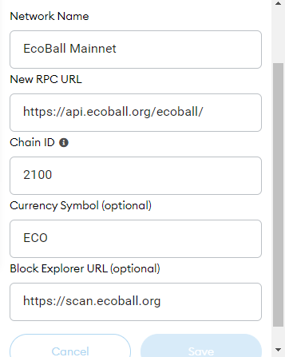

# Connect Your Wallet

## Smartphone/Mobile




To connect MetaMask to Exabc follow the steps below.

## Android and iOS

1. Open MetaMask and tap on the **burger icon** in the top-left.

1. Tap **Settings** in the menu.

1. In the Settings menu, tap on **Network**.

.png>)

1. Tap on the **Add Network** button at the bottom.

.png>)

1. On the page that opens, type in the following details:

**Network Name:** Ecoball Chain\
**RPC Url:** [https://api.Ecoball.org/Ecoball/](https://api.ecoball.org/Ecoball/)\
**Chain ID:** 2100\
**Symbol:** ECO\
**Block Explorer URL:** [https://scan.Ecoball.org](https://scan.ecoball.org)

1. Once you've confirmed entry of the new network, go back to the burger menu and tap **Browser**.

.png>)

1. Type "Exabc" into the search field and start the search. The top result will be the Exabc exchange. Tap to enter it.
2. You wallet will ask you to connect. Tap **Connect** to connect to Exabc.

## Resources

[**Download MetaMask**](https://metamask.io/download.html) (Automatically detects device)



If you have installed MetaMask wallet, add Ecoball mainnet to your wallet through the following steps:



Once you click ‘Custom RPC’, MetaMask wallet will ask for network information. Fill in the columns with Ecoball Mainnet information accordingly:

## **Desktop/Web Browser wallets**



.png>)

## Chrome and Firefox

1. Open MetaMask and click on the **network selector** at the top. By default it will show "Ethereum Mainnet". Scroll down and click **Custom RPC**.
2. A window will open. Type in the details below.

**Network Name:** Ecoball Chain\
**New RPC URL:** [https://api.Ecoball.org/Ecoball/](https://api.ecoball.org/Ecoball/)\
**Chain ID:** 2100\
**Currency Symbol (optional):ECO** \
**Block Explorer URL (optional):** [https://scan.Ecoball.org](https://scan.ecoball.org)

1. Make sure you've typed everything in correctly and click **Save**. EcoBall Chain will now be one of your network options.

1. Visit the Exabc website. In the top right corner you'll see the **Connect** button. Click it.

1. A window will appear asking you to choose a wallet to connect to. Click **MetaMask** (it's the top option on the list).

## Resources

[**Download MetaMask**](https://metamask.io/download.html) (Automatically detects browser)



After you save the network info, you may check your connectivity by going to Ecoball [validators page](https://scan.ecoball.org/validators) and connect to MetaMask wallet through ‘Login with MetaMask’ tab:

.PNG>)

Then MetaMask wallet will pop up a confirmation window, click ‘Next’ then ‘Connect’. Make sure your wallet is connected to Ecoball mainnet:

