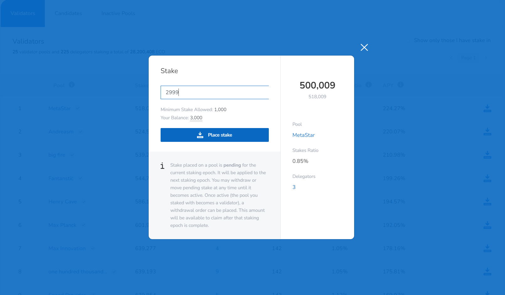
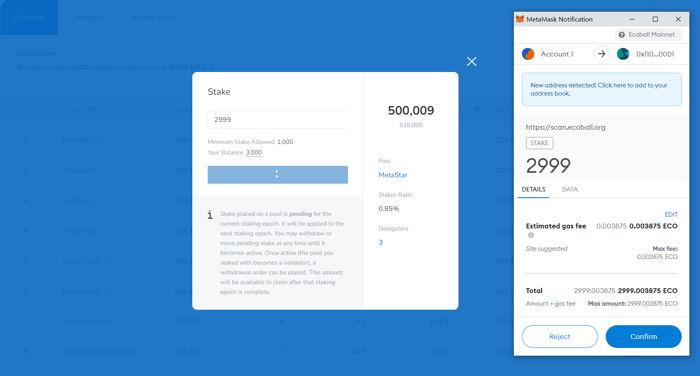
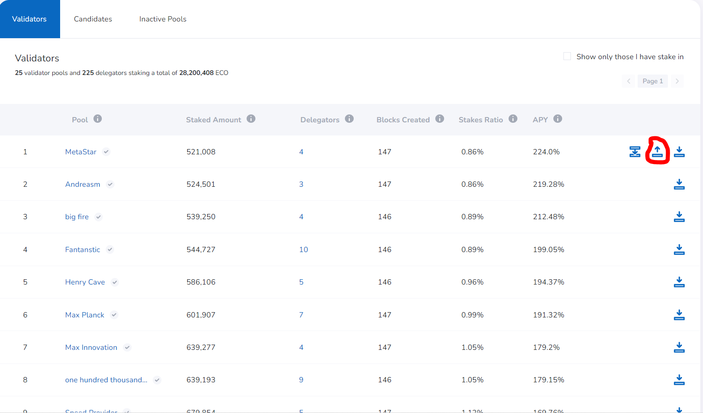
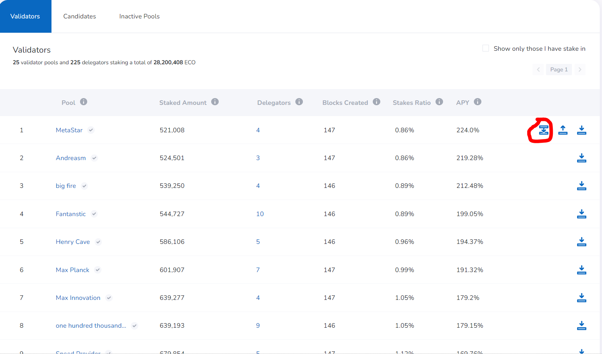
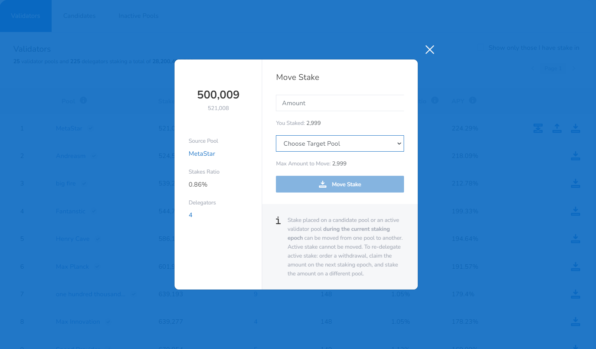

# Stake, Unstake and Move ECO

### **Stake ECO**

Voters (any ECO holder) have the right to stake and vote. You as a voter may click the stake button behind your favorite validator or candidate pool to stake and vote:

Then you will be asked for the amount of ECO you want to stake, **make sure you keep a small amount of ECO in your wallet to cover transaction gas fee.**

Once you confirm on your MetaMask wallet, then you are all set.

Remember: _**your stake is your vote.**_

### Unstake ECO

If you want to unstake, simply click ‘Withdraw’ button:

If you unstake from a validator's pool there may be two cases:

1. Your stake has not been registered for block reward, then your stake can be withdrawn right away;
2. Your stake has been registered for block reward, then when you withdraw, your stake will be held up until the next reward cycle. You may choose to withdraw partially, the remaining stake will be registered for the next block reward cycle. **See below demonstrations, note the difference in wording:**

For a validator pool, if all stake has been withdrawn, the pool will be moved to ‘Inactive Pools’; if the stake amount remains above 500,000 ECO, the validator’s election status remains unchanged.&#x20;

Note that the validator's stake amount has to be zero or any amount above 500,000 ECO, once the stake balance falls below 500,000 ECO, all stake will be withdrawn.

### Move Stake

You can move your stake from pool to pool without unstaking it, simply click the ‘Move’ button and select your target pool:

