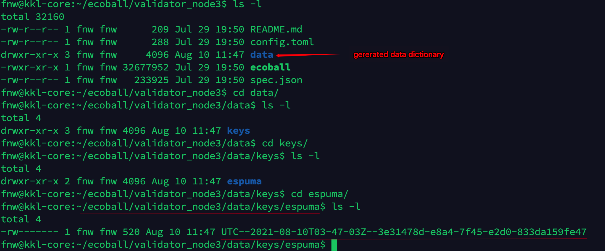
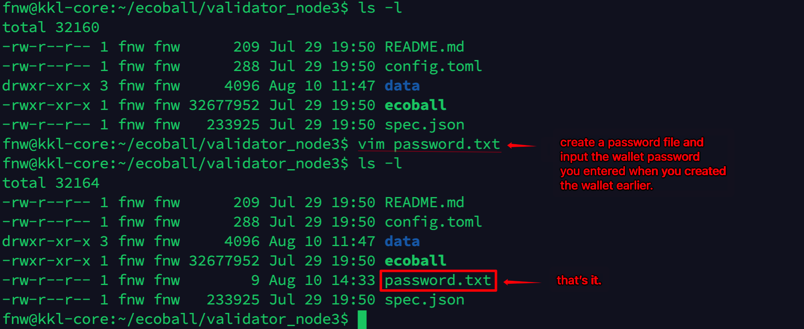
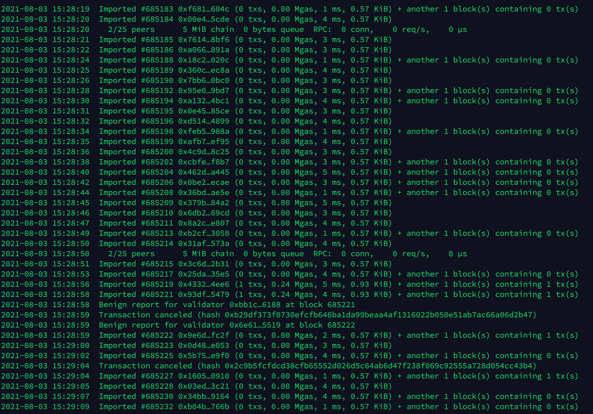

# Deploy Node

Validator node software is a cross-platform command line program, which for now only supports Linux system.&#x20;

Integration for MacOS, Windows will be coming soon.

### Download node software 

Create a folder and name it 'Ecoball' in the Linux system as the working directory of the Ecoball blockchain system, download the node software package to the folder:

> mkdir ecoball
>
> cd ecoball
>
> git clone [https://github.com/EcoballChain/validator-node](https://github.com/EcoballChain/validator-node)
>
> ​

The downloaded file:

> ls -l

Decompress the file, then in the decompressed directory, the default directory file name is 'validator\_node'. If you need to deploy multiple nodes, you may change rename the nodes to 'validator\_node1', 'validator\_node2', 'validator\_node3' and so on.

> cd validator\_node
>
> ls
>
> README.md config.toml ecoball spec.json

* README.md is the node installation configuration description file
* config.toml is the node startup configuration file
* ecoball is the node software,executable binary files
* spec.json is the initial data and structure specification file

The downloaded software usually does not have executable permissions, so it is necessary to authorize the node software.

> chmod +x ecoball

In addition, the corresponding configuration needs to be performed according to the instructions of the README.md file. Follow below steps for configuration:

Step 1: Create a wallet;

Step 2: Create a password file;

Step 3: Modify the startup configuration file;

Step 4: Launch the node software;

Step 5: Staking.

### Create a wallet 

Create a wallet:

> ./ecoball -c config.toml account new

A password prompt appears. Enter the wallet password twice to generate a wallet address. For example, here is the wallet address:

> 0x01c9a1515ae1d0df16e30f48ab5cbddcfd9413d4

Write down your wallet address and password, keep them safe.

After the wallet is created, the system automatically creates a data directory in the current directory, which contains the keys/espuma/directory structure. The following is the keystore file of the wallet. For asset security, it is recommended that this file be backed up and stored properly.

### Create a password file 

Create a password file.

> vim passwd.txt

Then enter the password you created early along with wallet creation above. Save and exit.

### Modify the startup configuration file 

> vim config.toml

The initial value of the node configuration file:

Modify following parameters according to the instructions in the README.md file:

* engine signer address: engine signature wallet address, use the wallet address created before as the transaction signature wallet
* password file: fill in the password file created before, and note that the brackets inside cannot be lost, otherwise an error will be reported
* unlock: unlock the wallet address, same as the engine signer, fill in the wallet address created before, the brackets cannot be lost

Save and exit. The modified configuration file is as follows:

## Launch node software to console 

Execute the following command to enter the console. If there is any error in the configuration file, the program will not run normally, and an error message will appear; if there is no error in the configuration file, you will be able to see the interface scrolling:

> ./ecoball --config config.toml

## Launch validator node software to background 

Launch the node software to run in the background, and output the log to the log file. It will not be closed even if the console is closed or disconnected. The following operations are required:

> nohup ./ecoball --config config.toml >ecoball.log 2>&1 &

If you need to monitor real-time logs, you can run the following command:

> tail -f ecoball.log

## Running in Windows 10 environment 

For now, there is only Linux version of the node program. If you do not have a Linux computer, Windows 10 could also work, a Linux running environment on Windows 10 will be required. Since the Linux subsystem is natively supported in Windows 10, you can run Linux directly on Windows 10, without the need for a separate installation of software like a virtual machine.

Users can first find the Microsoft Store on Windows 10, and then search 'Linux' in the App Store. Here we recommend the Ubuntu 20.04 LTS version.

Search for Linux to find and install Ubuntu:

Once Ubuntu is installed, run it:

The next time you use Ubuntu, you can run Ubuntu directly from the menu bar:

Every other setup steps are the same as the ones for Linux system.

### Become a candidate for staking mining 

After the node software is installed, deployed and running, it becomes a node server, and it starts to synchronize node data and verify transactions normally.

To become a candidate/verifier of EcoBall, the following criteria must be met:

1. Create a new wallet address on the staking mining page;
2. Staking≥ 500,000 ECO to the address;

For the specific operation process, please refer to Pledge | Pledge on the web side.


It should be noted that to pledge to become a candidate, it is best to wait for the node synchronization to complete before proceeding. Otherwise, if the synchronization is not completed, the application becomes a candidate, and then becomes a verifier, but because the synchronization is not completed, the block cannot be generated, which may result in punishment and loss.


## &#x20;
