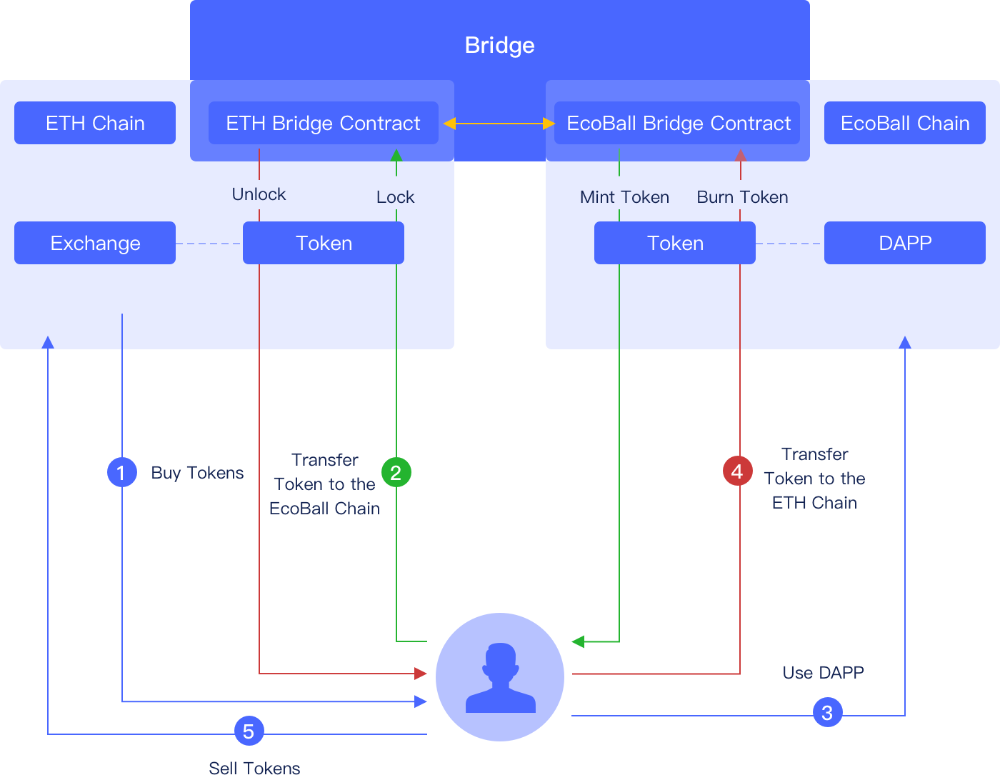
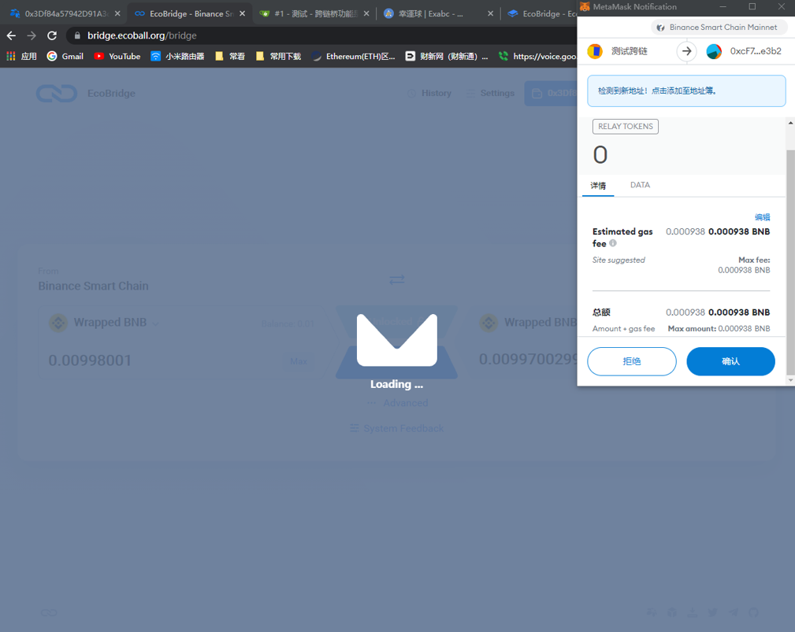

# EcoBridge

The EcoBridge is a function to interact with assets and data between external blockchains and Ecoball blockchains, allowing users to transfer assets between EVM compatible chains, improving scalability and interoperability.

EcoBridge currently supports cross-chain from Ethereum to Ecoball. Below is a workflow chart of Ethereum Testnet Georli crosses chain to the Ecoball testnet chain:

### Use

To use the bridge function, you must first install a web-based or desktop digital wallet. For details, see [Desktop Wallet](../for-users/digital-wallet/web-digital-wallet.md).

1）Open the chain bridge page: [https://bridge.ecoball.org/](https://bridge.ecoball.org) as shown below:

.png)

2）Click the 'connect' button, the select wallet page is displayed as shown below:

.png)

3）Select MetaMask wallet to enter the cross-chain bridge page, as shown below:

.png)

4）Select the tokens to cross the chain and add them if they are not on the list：

.png)

5）MetaMask authorization is required for unlocking on the original chain. Click confirm button for authorization, as shown in the figure below：

6）After unlocking, click the 'Transfer' button to Transfer the Token, as shown below：

7）If you need to confirm asset transfer, a confirmation dialog box is displayed, as shown in the following:

.png)

8）After confirming the Token transfer, MetaMask wallet will be called again for authorization, as shown below:

9）After authorization, the system immediately transfers the cross-chain assets, which needs to wait for the confirmation of several blocks. Depending on the network condition, it generally takes several minutes, as shown in the figure below：

.png)

After sufficient block confirmations, the tokens on the original chain are converted into tokens on the target chain.
