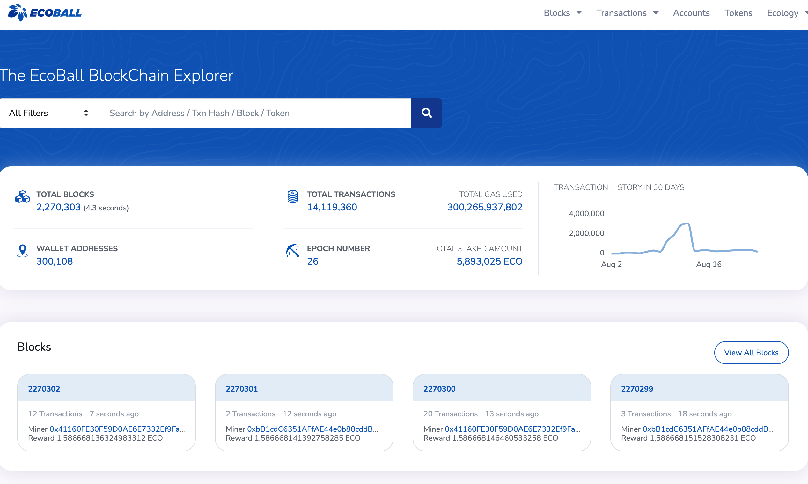
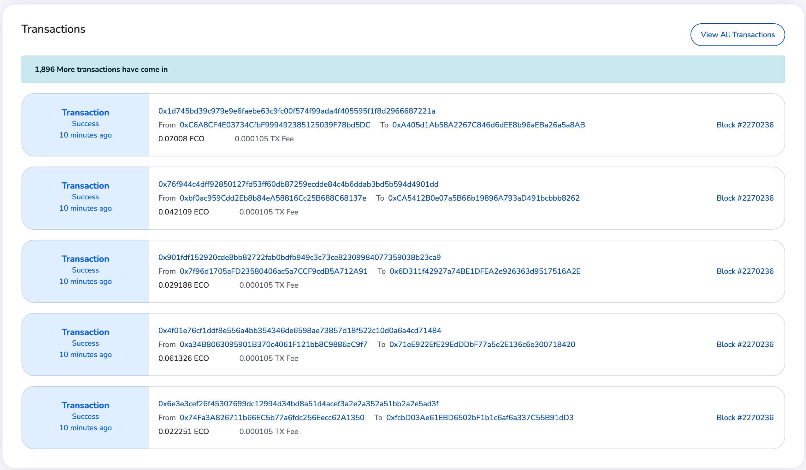

# EcoScan

EcoScan is Ecoball's blockchain explorer, allowing users to explorer the block and transaction information. ECO holders, may also use this page to apply to become a candidate, participate in the validator campaign, or participate in the staking. For more information, please see [Staking mining](../for-users/staking-and-voting/).

Link to EcoScan: [https://scan.ecoball.org/blocks](https://scan.ecoball.org/blocks)

