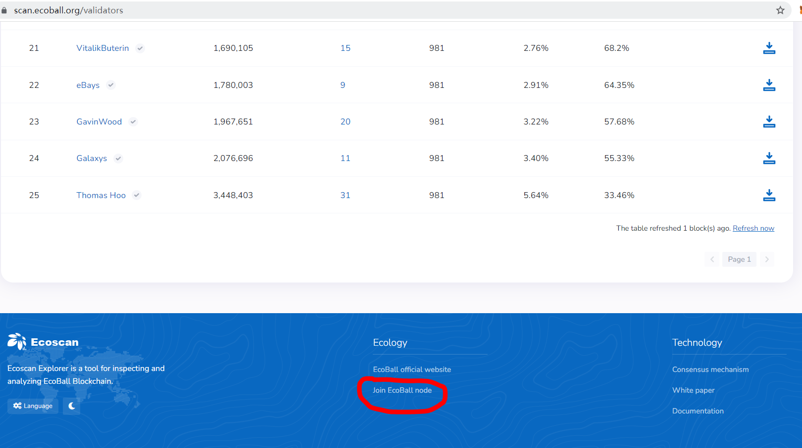
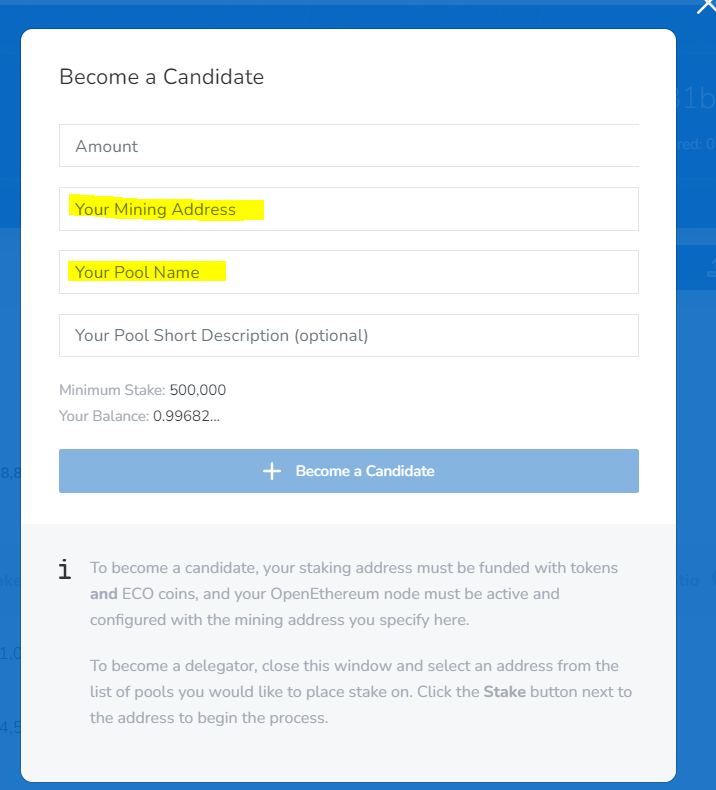

# Become a Candidate

If you hold more than 500K ECO, you have the choice to become a candidate (who may be elected to be a validator).&#x20;

Before you apply to be a candidate, you will need to set up your node first to obtain mining address and pool details.&#x20;

Instruction on how to set up a node is down at the bottom of the page ‘Join Ecoball node’: [https://scan.ecoball.org/validators](https://espuma-scan.ecoball.org/validators)

After your node set up, you may click ‘+ Become a Candidate’ on [https://scan.ecoball.org/validators](https://scan.ecoball.org/validators) and enter your node information:

