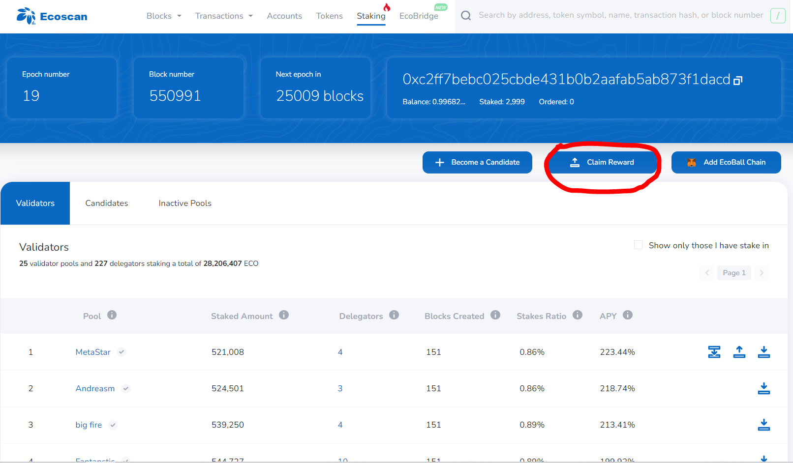

# Claim Staking Rewards

If you stake your ECO in a validator's pool for at least one full cycle (≈ one day, 28800 blocks), you may claim your rewards.

The reward cycle breakdown: T (staking cycle, current block creation cycle), T+1 (block creating and rewarding cycle), T+2 (rewards claimable cycle). For full details please see [Rules](election-rules.md).

To make sure your rewards will be compounded in your stake and registered in the next block generating and rewarding cycle, you must claim rewards by yourself:

