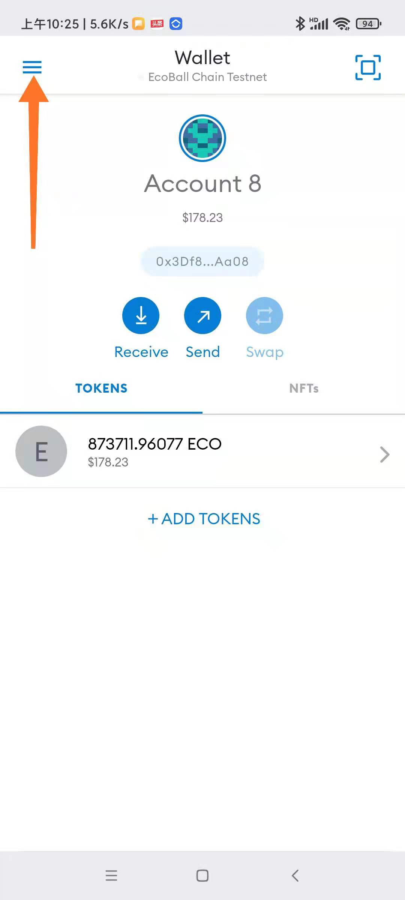
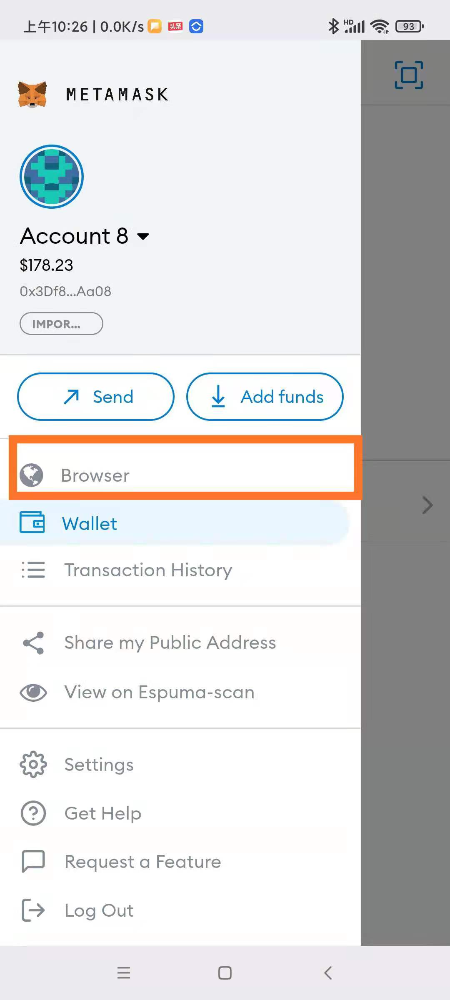
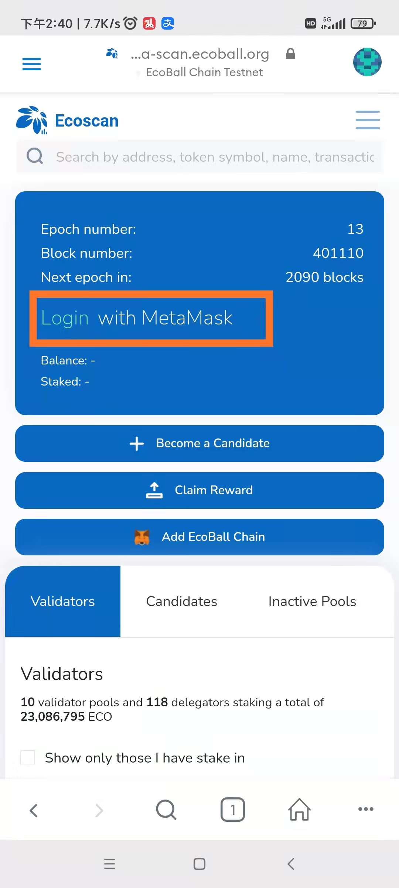
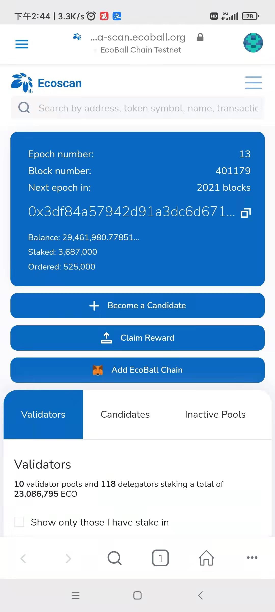

# Mobile staking

To stake on mobile phones, you need to download and install MetaMask digital wallet or ImToken digital wallet, and then staking. In this paper, MetaMask mobile wallet is used as an example to explain the mobile terminal staking.

## Install the mobile phones wallet 

The first step is to install MetaMask mobile wallet. Please download and install it by yourself.

## Configure the blockchain network 

Once the MetaMask wallet is installed, Ecoball blockchain network parameters need to be configured. For details, see ​ [Mobile](mobile-staking.md) [digital](mobile-staking.md) ​[wallet](mobile-staking.md).

## Staking from Mobile phone 

Staking on a mobile phone also requires invoking the staking function of the Ecoball blockchain explorer. Therefore, you need to open the Ecoball blockchain explorer on the MetaMask mobile phone to visit the staking and voting page. As shown below:

1）Open the digital wallet main menu

2）Open the built-in browser of the wallet, special attention must be paid here. You need to access the built-in browser environment from the "Browser" function menu in the main menu of the MetaMask wallet:

3）The built-in browser is the dAPP execution environment of the wallet. The default page is as follows：

4）In the built-in browser address field enter the staking&voting page address \([https://espuma-scan.ecoball.org/validators](https://espuma-scan.ecoball.org/validators)\) :

5）After entering the staking&voting page, you need to connect the wallet to conduct subsequent operations such as staking and voting. Click the "Connect" button here：

The other operations about _staking and voting_ are the same as the web side, please refer to [_Web staking_](web-staking.md)_._

