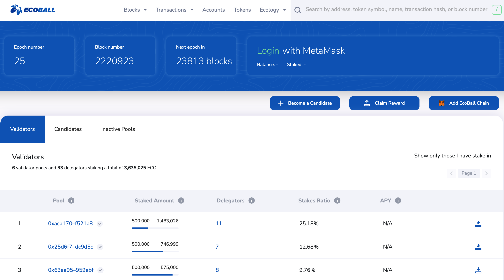
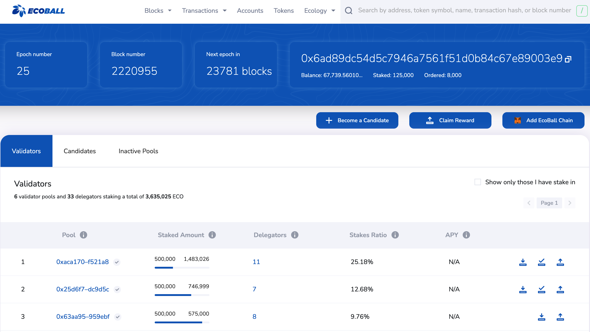
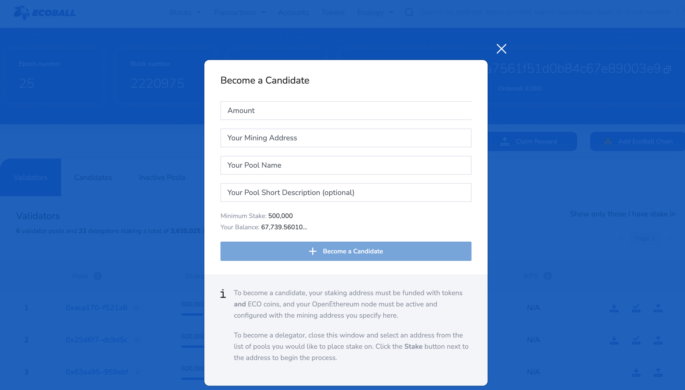
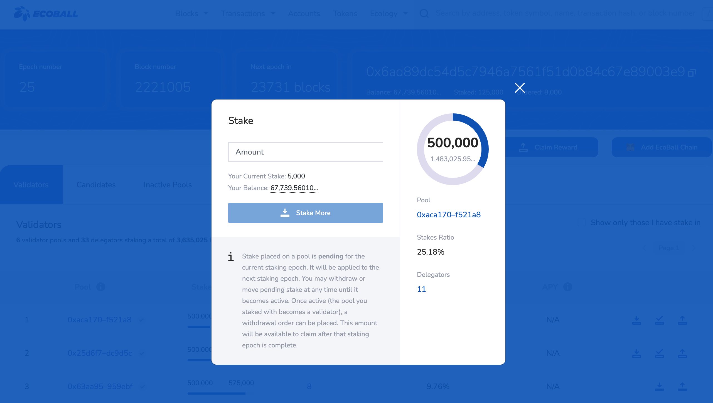
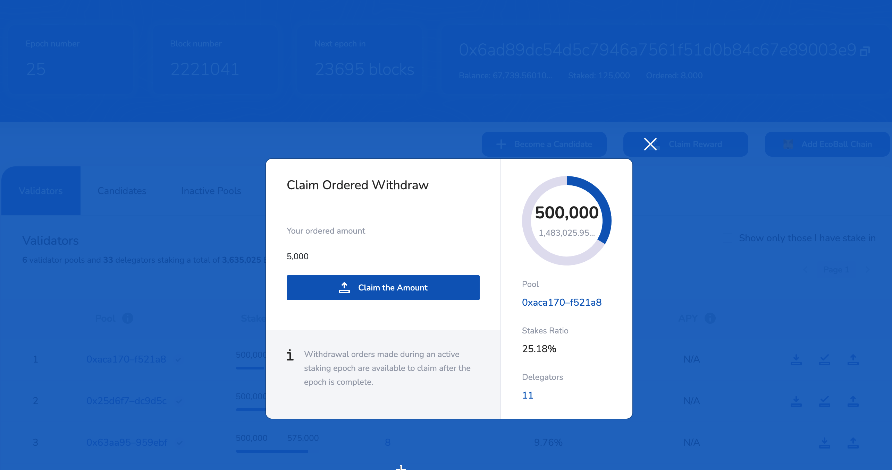
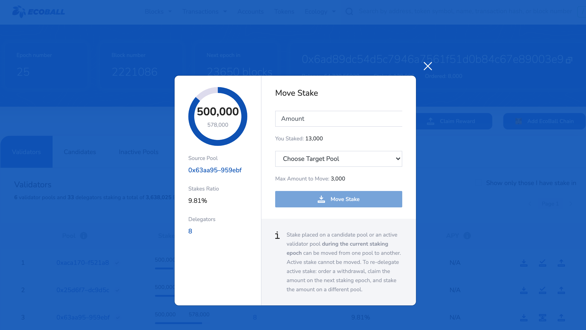
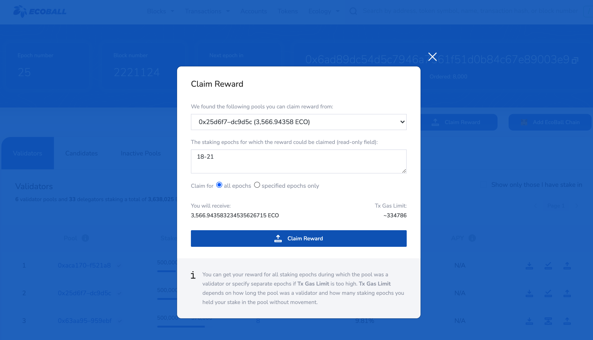

# Web staking

## Connect wallet 

1）Open Ecoball staking and voting website：[https://espuma-scan.ecoball.org/validators，](https://espuma-scan.ecoball.org/validators%EF%BC%8C) or open Ecoball official website ：[https://ecoball.org。](https://ecoball.org./)​

Click the "Validator" menu to open the voting and staking page. Chrome, Firefox, or Edge are recommended.

2）Click the "Connect"\(or "Login"\) button, and the web page will automatically determine whether the user has installed MetaMask wallet plug-in. If not, it will install the wallet according to the process prompted. If installed, the MetaMask wallet is called to connect. If the user does not log in, the login page is displayed to remind the user to log in to the wallet. The wallet after successful connection is displayed as follows:

3）After installing MetaMask wallet plug-in, the user enters the voting and staking page and clicks "Add Ecoball Chain" button on the page. At this time, the MetaMask wallet will automatically link to the Ecoball Chain network. If the MetaMask is not connected to the Ecoball Chain, the user needs to manually add the Ecoball Chain node information in the MetaMask Settings.

For details, see [Web Digital Wallet](../digital-wallet/web-digital-wallet.md).

## Add candidates 

To become a validator, users need to hold more than 500,000 ECO and must first apply to become a candidate. The user clicks on the "Become a candidate" button and a page pops up, as shown below.

Users need to deploy a validation node first, for details, please refer to [deploy a node](https://setupnode.md/). User will get a Ecoball mineral pool address block chain after deploying, then fill in this mine pool address information of the pop-up window, click "become" candidates, the system will automatically check the information provided by the user, afer validating information the user became a candidate, If no, you need to check whether the number and address of the pool are correct.

Users can name their pools and fill in instructions for other users to vote on them.

Creating the pool requires the user to pay the GAS fee for the Ecoball blockchain, which the user does according to a pop-up window in MetaMask.

## Staking ECO 

Voting users \(validators/candidates/other ECO holders\) can vote for the validators/candidates listed in the list. The user clicks the "STAKE" button on the home page, and a staking and voting window pops up \(as shown in the picture below\). The minimum staking of each mine pool is 5000ECO, as shown in the picture below.

The staking requires the user to pay for GAS on the Ecoball blockchain, which the user does according to a pop-up window on MetaMask.

## Withdraw staking 

If the validator/candidate/staking user wants to exit the mining pool or withdraw the amount of their staking, they can click the "Withdraw" button, then a page will pop up, as shown in the picture below.

There are three function on the withdraw page:

1. Immediate withdraw: The ECO staking by the user does not participate in the block reward, so the user can withdraw part or all of it.
2. Order withdrawal: The ECO staking by the user participates in the block release reward. At this time, the withdrawal required by the user can only be order withdrawal. The user selects part to withdraw, and the remaining quantity is ≥5000. In the next block producing cycle, the user will participate in the block producing reward, and the reward will be calculated according to the remaining quantity.
3. The validator "order withdrawal", the validator chooses to withdraw all, and the pool selected by the validator enters the inactive pool and does not participate in the election of the next block producing cycle; The validator chooses partial withdrawal, and the remaining quantity is ≥50W. The validator's election in the next block producing cycle is not affected.

## Transfer staking 

If the staking user, such as validator or candidate, wants to transfer the staking ECO to another mining pool, he can choose the transfer function. Instead of withdrawing the ECO from the original mining pool, the transfer requires deducting the GAS charge and the user needs to connect his wallet. As shown in the figure below.

## Claim reward 

Users who have staked, such as validator or candidate, can claim profits at any time. Calculation method of income period:

T cycle \(refers to the block release period at that time\) staking,

T+1 cycle block release reward,

T+2 cycle income to the account.

The user's income must be manually claimed by the user \(immediately transferred to the account\). If the user does not claim, the accumulated income will increase and the income will not participate in the staking block reward.

If the user clicks the "claim reward" button, if the user has income, as shown in the figure below, the accumulated income of each mining pool of the user is displayed.

